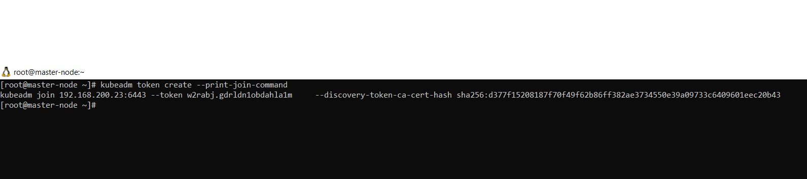

# One_Click_K8s_Cluster
With this we can easily setup 3 node Kubernetes cluster on a go

STEP 1 - make sure you have ansible installed on your device and all the nodes are password less [Key based Auth].

STEP 2 - insert ip and hostname details inside 'inventory' file
Example-
192.168.200.23
192.168.200.24
192.168.200.25

STEP 3 - insert host entries for /etc/hosts for all nodes in hosts.j2 file
Example-
192.168.200.23 master-node

STEP 4 - Run Ansible command
Example-
Go to main directory:
ansible-playbook -i inventory main.yaml

NOTE - this may take some time to fetch repo, images from internet ["totally depends upon your internet connection"]

STEP 5 - Once the master node is ready you will see cluster join token in your screen and you need to enter this commands in both worker node to join the cluster
something like this:

kubeadm join 192.168.200.23:6443 --token qwb98v.mtfn7e77ny5sh6km     --discovery-token-ca-cert-hash sha256:d377f15208187f70f49f62b86ff382ae3734550e39a09733c6409601eec20b43

NOTE: you can also generate this token from master node:
cmd - kubeadm token create --print-join-command

